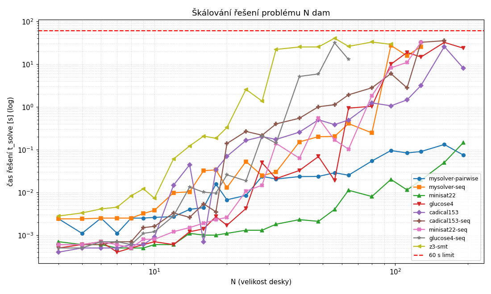

# N dam (úloha 1)

Měřím, jak roste čas řešení s počtem dam u různých solverů.

Kódování:

- CNF: proměnná `x[r][c]` znamená dámu na poli (r,c). V každém řádku aspoň jedna dáma, v každém sloupci a na každé diagonále nejvýš jedna. At-most-one dělám dvěma způsoby:
  - pairwise: zakážu každou dvojici, klauzulí je řádově N³,
  - seq: sekvenční čítač, ~O(N²) klauzulí plus pomocné proměnné.
- SMT (z3): `q[i]` je sloupec dámy v řádku i, pak jen `Distinct(q)`, `Distinct(q[i]-i)` a `Distinct(q[i]+i)`. Dohromady N proměnných.

Solvery: můj C# CDCL (`../../solver`, přes DIMACS), PySAT (`minisat22`, `glucose4`, `cadical153`) a z3 s celočíselným modelem. Obě CNF kódování pouštím na všech čtyřech CDCL solverech.

## Max N do 60 s

| solver | kódování | max N | t_solve u max N | co limituje |
|---|---|--:|--:|---|
| mysolver | pairwise | 192 | 0.074 s | kódování (paměť) |
| mysolver | seq | 128 | 25.684 s | řešení (> 60 s) |
| minisat22 | pairwise | 192 | 0.147 s | kódování (paměť) |
| glucose4 | pairwise | 192 | 23.547 s | kódování (paměť) |
| cadical153 | pairwise | 192 | 8.001 s | kódování (paměť) |
| cadical153 | seq | 160 | 35.203 s | řešení (> 60 s) |
| minisat22 | seq | 128 | 32.486 s | řešení (> 60 s) |
| glucose4 | seq | 64 | 12.865 s | řešení (> 60 s) |
| z3 | SMT int | 96 | 29.038 s | řešení (> 60 s) |

Všechny čtyři pairwise konfigurace zastaví na N=192 ten samý paměťový strop (N=224 už generátor přeskočí jako `pairwise too big`). Rozdíl je jen v tom, kolik u N=192 stojí samotné řešení, proto je u mysolveru a minisat22 jako limit uvedené kódování (řeší pod 0,15 s), kdežto glucose4 a cadical153 se k vlastnímu solver-limitu už blíží (8 až 24 s).

## Stejná CNF (pairwise), čistý čas řešení t_solve [s]

| N | mysolver | minisat22 | glucose4 | cadical153 |
|--:|--:|--:|--:|--:|
| 32 | 0.021 | 0.002 | 0.021 | 0.173 |
| 64 | 0.025 | 0.011 | 0.933 | 0.491 |
| 96 | 0.095 | 0.020 | 9.950 | 1.058 |
| 128 | 0.090 | 0.019 | 14.637 | 3.159 |
| 160 | 0.132 | 0.050 | 32.241 | 25.703 |
| 192 | 0.074 | 0.147 | 23.547 | 8.001 |

## Stejná CNF (seq), čistý čas řešení t_solve [s]

| N | mysolver | minisat22 | glucose4 | cadical153 |
|--:|--:|--:|--:|--:|
| 32 | 0.030 | 0.140 | 0.141 | 0.399 |
| 64 | 0.406 | 0.102 | 12.865 | 1.913 |
| 96 | 27.367 | 8.188 | - | 5.989 |
| 128 | 25.684 | 32.486 | - | 32.356 |
| 160 | - | - | - | 35.203 |

Na seq je rozsah menší, žebřík končí dřív (pomlčka znamená, že to dané N solver v limitu nedořešil). Pořadí se proti pairwise obrací, nejlíp funguje cadical153. Jako jediný dojede na 160 a u N=96 je se ~6 s nejrychlejší, zatímco mysolver tam má 27 s a glucose4 je nejhorší, u N=64 už 13 s a výš se nedostane.



## Závěr

N dam je lehce splnitelná instance, takže o tom, jak velké N projde do minuty, většinou nerozhoduje hledání řešení, ale samotné kódování a to, jak na něm solver propaguje.

Pairwise narazí kolem N≈210 na paměť (počet klauzulí roste kubicky a generátor se zastaví na pojistce proti OOM), takže se všechny čtyři pairwise konfigurace zaseknou shodně na N=192. Na stejné CNF se ale solvery liší až o tři řády. minisat22 a můj solver najdou model i pro N=192 pod 0,15 s, tam je tedy nelimituje řešení, ale generátor a paměť. Naproti tomu glucose4 a cadical153 u N=192 počítají 8 až 24 s a u N=160 dokonce 25 až 32 s. Vypadá to, že na splnitelné symetrické instanci agresivní restarty a mazání klauzulí (glucose, cadical) spíš škodí, hledání se netrefí. Časy jsou z jednoho běhu a u SAT instancí dost šumí a nejsou monotónní (glucose má N=192 rychlejší než N=160, cadical u N=192 jen 8 s, ale u N=160 přes 25 s).

Sekvenční kódování šetří paměť (O(N²) klauzulí, žádný kubický nárůst), ale propaguje slaběji, takže řešení je těžší a měkká hranice řešitelnosti přijde dřív než tvrdá paměťová zeď u pairwise. V tomhle experimentu se proto seq u žádného solveru nedostane výš než pairwise. cadical153-seq zvládne 160, mysolver-seq a minisat22-seq 128 a glucose4-seq jen 64 (nejhůř ze všech, u N=80 dokonce přestal reagovat na interrupt a musel ho zabít vnější timeout). Hezky je to vidět na minisat22: na pairwise dojede na 192 v pohodě, ale na seq spadne na 128.

SMT model v z3 má dosah nejmenší. Distinct nad aritmetikou je těžký, časy rostou strmě a nepravidelně (u N=32 už 22 s) a do minuty projde jen N=96.

## Testování

```powershell
python bench.py run --budget 60 --csv results/scaling.csv
python summarize.py results/scaling.csv 60     # tabulky -> results/summary.md, graf -> imgs/scaling.png
```

Jednotlivá úloha (vrátí JSON s časy), případně rychlá ukázka:

```powershell
python bench.py worker --family pysat --n 100 --encoding pairwise --backend minisat22
python bench.py worker --family z3 --n 40 --encoding intmodel
python nqueens.py 8 --board
```
